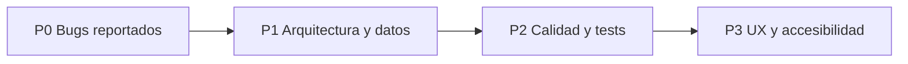

# Plan de Implementación — ¿Qué Cocino?

> **Destinatario:** agente de IA ejecutor (Gemini 3.8) o desarrollador.
> **Fecha de auditoría:** 2026-10-03
> **Alcance:** bugs reportados (viewport no responsive, ingredientes duplicados por voz) + debilidades detectadas en la inspección completa del proyecto.

---

## 0. Instrucciones para el agente ejecutor

1. Ejecuta las fases **en orden** (P0 → P3). Cada tarea tiene un ID (`P0-1`, `P1-3`…) y criterios de aceptación.
2. Después de cada fase ejecuta las verificaciones de la sección **"Verificación"** de esa fase. No avances si fallan.
3. No elimines comentarios/documentación existente que no esté relacionada con el cambio.
4. Todo el texto visible por el usuario debe seguir en **español**.
5. Implementa sin pedir confirmación al usuario (regla del proyecto). Si una decisión es ambigua, elige la opción marcada como **(Recomendado)** y déjalo anotado en la sección 7 ("Registro de ejecución") al final de este archivo.
6. El proyecto **no está bajo git**. Antes de empezar, crea una copia de seguridad: `Copy-Item -Recurse "Que COCINO" "Que COCINO_backup_<fecha>"` (excluyendo `node_modules` y `android/**/build`), o inicializa git (ver `P2-1`) y haz un commit inicial.

### Mapa del proyecto (contexto imprescindible)

| Ruta | Qué es | Estado |
|---|---|---|
| `index.html` (raíz, 1420 líneas) | Prototipo HTML/JS monolítico con Tailwind CDN, simula un iPhone. | **Es lo que se empaqueta hoy en Android.** |
| `android/app/src/main/assets/www/index.html` | Copia **idéntica** del `index.html` raíz (sincronizada a mano). | Duplicado |
| `android/.../MainActivity.java` | `WebView` nativo plano (NO es Capacitor `BridgeActivity`). Carga `file:///android_asset/www/index.html`. | |
| `capacitor.config.json` + `package.json` raíz | Dependencias Capacitor 5 declaradas pero **no integradas** en el proyecto Android. `webDir` apunta a la carpeta de assets de Android (incorrecto). | Roto |
| `webapp/` | App real React 19 + Vite 8 + Tailwind 4 + React Query + Supabase (con fallback a `localStorage`). | Compila (`npm run build` OK, aviso de chunk > 500 kB). **No se empaqueta en Android.** |

> [!IMPORTANT]
> Existen **dos implementaciones paralelas** de la app. Los dos bugs reportados existen en **ambas**. La fase P0 los corrige en las dos; la fase P1 (`P1-1`) unifica para que Android empaquete la `webapp` y el prototipo quede archivado.

---

## 1. FASE P0 — Bugs reportados (crítico)

### P0-1 · Viewport incorrecto / no responsive — prototipo raíz (`index.html`)

**Causa raíz** (`index.html`):
- L5: `<meta name="viewport" content="width=device-width, initial-scale=1.0">` sin `viewport-fit=cover` → no respeta notch/barras del sistema.
- L144: `<body class="min-h-screen p-2 md:p-4 ... overflow-hidden">` → padding alrededor y `100vh` (en móvil `100vh` incluye la barra del navegador; el contenido queda cortado).
- L147: contenedor **"iPhone mockup"** con `max-w-[400px] h-[830px] max-h-[96vh] rounded-[44px] border-[10px]` → dentro de un teléfono real se dibuja *otro* teléfono, con bordes negros, esquinas redondeadas y altura fija.
- L150-160: **barra de estado falsa** ("9:41", señal, wifi, batería) duplicando la barra real de Android.
- Alturas fijas en px dentro de pantallas: `max-h-[440px]` (L386), `max-h-[340px]` (L676), `max-h-[460px]` (L759), `h-52`, `w-60 h-60` (L184) → no se adaptan a pantallas pequeñas ni grandes.
- `.screen-slide` usa `position:absolute; inset:0; overflow-y:auto` pero las pantallas usan `justify-between`, lo que en pantallas bajas hace solapar contenido y botón.
- Navegación por **swipe horizontal global** (L950-961) sobre `#app-container`: cualquier gesto horizontal (p. ej. al hacer scroll en diagonal) cambia de pantalla, incluso saltando a pantallas que requieren datos.

**Cambios:**
1. Meta viewport:
   ```html
   <meta name="viewport" content="width=device-width, initial-scale=1, viewport-fit=cover">
   <meta name="theme-color" content="#4CAF50">
   ```
2. Eliminar el *mockup* de teléfono y la barra de estado falsa. Estructura objetivo:
   ```html
   <body class="bg-white text-gray-900 overflow-hidden select-none">
     <div id="app-shell" class="app-shell">
       <div id="app-container" class="relative flex-1 overflow-hidden"> ...pantallas... </div>
     </div>
   </body>
   ```
   ```css
   html, body { height: 100%; margin: 0; }
   .app-shell {
     display: flex; flex-direction: column;
     height: 100vh;            /* fallback */
     height: 100dvh;           /* navegadores modernos */
     width: 100%;
     max-width: 480px;          /* en tablet/desktop se centra */
     margin: 0 auto;
     padding-top: env(safe-area-inset-top);
     padding-bottom: env(safe-area-inset-bottom);
     padding-left: env(safe-area-inset-left);
     padding-right: env(safe-area-inset-right);
     background: #fff;
   }
   @media (min-width: 768px) {
     body { background: #0F172A; }
     .app-shell { box-shadow: 0 25px 60px -15px rgba(0,0,0,.6); }
   }
   ```
   (Opcional: mantener el mockup **solo** si `?mockup=1` está en la URL, para demos en escritorio.)
3. Reemplazar alturas fijas (`max-h-[440px]`, `max-h-[340px]`, `max-h-[460px]`) por layout flexible: la zona de lista con `flex-1 min-h-0 overflow-y-auto`, cabecera y botón con `shrink-0`.
4. Ilustraciones: `w-60 h-60` → `w-[min(60vw,15rem)] aspect-square`; `w-48 h-48` → `w-[min(48vw,12rem)] aspect-square`.
5. Cambiar `justify-between` de las pantallas por: header `shrink-0` / contenido `flex-1 min-h-0 overflow-y-auto` / footer `shrink-0`.
6. Swipe: eliminar la navegación global por swipe y por flechas de teclado **o** limitarla a pantallas de solo-lectura (5, 9) y exigir `|dx| > 80 && |dx| > 2*|dy|`. **(Recomendado: eliminar.)**
7. Android: en `MainActivity`, activar edge-to-edge coherente o, si no, dejar el sistema gestionar la barra de estado (no dibujar la falsa). Ver `P1-4`.

**Criterios de aceptación:**
- En Chrome DevTools (modo dispositivo) para 360×640, 390×844, 412×915, 768×1024 y 1280×800: no hay scroll de página, no hay marco de teléfono, no hay barra "9:41", ningún botón principal queda fuera de pantalla y las listas hacen scroll interno.
- En Android real/emulador: la app ocupa toda la pantalla bajo la barra de estado real.

---

### P0-2 · Viewport / responsive — `webapp` (React)

**Causa raíz:**
- `webapp/index.html` L6: `maximum-scale=1.0, user-scalable=no` (bloquea zoom → problema de accesibilidad WCAG 1.4.4) y falta `viewport-fit=cover`.
- `min-h-screen` (= `100vh`) en todas las páginas (`App.tsx` L24, `HomePage`, `VoicePage`, `ConfirmIngredientsPage`, `DashboardPage`, `InventoryPage`, `RecipeDetailPage`, `ImpactPage`, `ProtectedRoute`, auth). En móviles `100vh` > área visible → contenido y botones inferiores cortados.
- `pt-12` fijo como "safe area" en todos los headers en lugar de `env(safe-area-inset-top)`.
- `BottomTabBar.tsx` L27: `h-16` + `safe-bottom` (padding) en el mismo elemento → en iPhone/Android con gestos el padding comprime los iconos. Además `fixed ... max-w-md mx-auto` con `left-0 right-0` funciona, pero el contenido de páginas con CTA inferior propio (Inventory, RecipeDetail, Confirm) queda tapado por la barra (el `pb-16` del wrapper no contempla la safe-area).
- Botones de CTA inferior (`ConfirmIngredientsPage` L210, `RecipeDetailPage` L208, `InventoryPage` L351) no son *sticky*: en listas largas el usuario debe hacer scroll hasta el final.

**Cambios:**
1. `webapp/index.html`:
   ```html
   <meta name="viewport" content="width=device-width, initial-scale=1, viewport-fit=cover" />
   ```
2. `index.css` (`@layer base` / `@layer utilities`):
   ```css
   :root {
     --safe-top: env(safe-area-inset-top, 0px);
     --safe-bottom: env(safe-area-inset-bottom, 0px);
     --tabbar-h: 4rem;
   }
   html, body, #root { height: 100%; }
   @layer utilities {
     .min-h-app { min-height: 100vh; min-height: 100dvh; }
     .h-app { height: 100vh; height: 100dvh; }
     .pt-safe { padding-top: calc(var(--safe-top) + 1rem); }
     .pb-safe { padding-bottom: var(--safe-bottom); }
     .pb-tabbar { padding-bottom: calc(var(--tabbar-h) + var(--safe-bottom)); }
   }
   ```
   y eliminar/ajustar `.safe-bottom` actual.
3. Sustituir globalmente `min-h-screen` → `min-h-app` y `pt-12` (headers) → `pt-safe` (revisar visualmente; en auth `py-12` puede quedarse).
4. `App.tsx` L24: `max-w-md mx-auto min-h-app bg-white shadow-xl relative` y aplicar `pb-tabbar` **solo** cuando la tab bar es visible (mover la lógica `isHidden` a un hook `useTabBarVisible()` compartido por `App` y `BottomTabBar`).
5. `BottomTabBar.tsx`: contenedor `fixed bottom-0 inset-x-0 mx-auto max-w-md pb-safe`, y `nav` con `h-16` sin padding.
6. CTAs inferiores: `sticky bottom-0` (o `bottom-[calc(var(--tabbar-h)+var(--safe-bottom))]` cuando haya tab bar) con fondo blanco.
7. Layout desktop (≥ 768px): mantener columna centrada `max-w-md`, fondo `bg-gray-100` en `body`.

**Criterios de aceptación:** mismas resoluciones que P0-1; se puede hacer zoom con pellizco; ningún CTA queda tapado por la tab bar; `npm run build` sin errores.

---

### P0-3 · Ingredientes repetidos en el comando por voz — `webapp`

**Causa raíz principal** — `webapp/src/hooks/useSpeechRecognition.ts` L76-93:
```ts
for (let i = 0; i < event.results.length; i++) {   // ← recorre TODOS los resultados desde 0
  if (result.isFinal) finalText += ...
}
if (finalText) setTranscript(prev => (prev + finalText).trim())  // ← y los AÑADE a lo previo
```
`event.results` es **acumulativo** durante la sesión `continuous`. Cada evento vuelve a sumar todos los finales anteriores → "tomates" → "tomates tomates huevos" → … Además:
- En **Chrome Android**, con `continuous = true`, cada resultado final suele contener el texto completo previo (bug conocido), lo que duplica aunque se use `resultIndex`.
- Con `React.StrictMode` (`main.tsx`), el `useEffect` se ejecuta dos veces en desarrollo y crea **dos instancias** de reconocimiento sin limpieza (no hay `return () => recognition.abort()`), con dos `onresult` activos.
- `startListening`/`stopListening` dependen de `isListening` (estado) → closures obsoletas y dobles `start()`.
- `extractIngredients` (`ingredientParser.ts`) no deduplica: "tomates … tomates" genera dos filas.
- `ConfirmIngredientsPage` → `addIngredients` inserta siempre filas nuevas; si el ingrediente ya existe en el inventario se duplica (ni `localStore.addInventory` ni el insert de Supabase fusionan).

**Cambios:**
1. Reescribir el `onresult` reconstruyendo el transcript **desde cero** en cada evento (idempotente), sin concatenar con el estado previo:
   ```ts
   recognition.onresult = (event) => {
     let finalText = ''
     let interimText = ''
     for (let i = 0; i < event.results.length; i++) {
       const r = event.results[i]
       if (r.isFinal) finalText += r[0].transcript + ' '
       else interimText += r[0].transcript
     }
     setTranscript(collapseRepeats(finalText.trim()))   // reemplaza, no concatena
     setInterimTranscript(interimText)
   }
   ```
   - Añadir `resultIndex` al tipo `SpeechRecognitionEvent`.
   - Si se requiere conservar texto entre sesiones (pulsar el micro varias veces), guardar el texto de sesiones anteriores en un `useRef<string>` (`committedRef`) que se actualiza en `onend`, y mostrar `committedRef.current + ' ' + sesionActual`.
2. **Mitigación Android:** detectar `/Android/i.test(navigator.userAgent)` y usar `continuous = false` + reinicio automático en `onend` mientras el usuario no pulse "parar" (flag en `useRef`). Así cada sesión devuelve un único resultado final.
3. Función `collapseRepeats(text)` en `ingredientParser.ts` (o `lib/textUtils.ts`): elimina repeticiones consecutivas de frases/n-gramas y la repetición "texto completo + texto completo" típica de Android:
   ```ts
   export function collapseRepeats(text: string): string {
     const words = text.split(/\s+/).filter(Boolean)
     // Elimina secuencias repetidas consecutivas de 1..8 palabras
     for (let n = 8; n >= 1; n--) {
       for (let i = 0; i + 2 * n <= words.length; ) {
         const a = words.slice(i, i + n).join(' ').toLowerCase()
         const b = words.slice(i + n, i + 2 * n).join(' ').toLowerCase()
         if (a === b) words.splice(i + n, n)
         else i++
       }
     }
     // Si un segmento es prefijo del siguiente (Android acumulativo), quedarse con el más largo
     return words.join(' ')
   }
   ```
4. Ciclo de vida del hook:
   - `useEffect` con cleanup: `return () => { recognition.onresult = null; recognition.onend = null; recognition.abort() }`.
   - `isListeningRef` (`useRef`) para `start/stop` estables (`useCallback` sin dependencias).
   - Crear la instancia con `SpeechRecognitionAPI` resuelto **dentro** del efecto.
   - `lang`: usar `navigator.language` si empieza por `es` (p. ej. `es-AR`), si no `es-ES`.
5. Deduplicar en el parser — `extractIngredients`: normalizar nombre (minúsculas, sin acentos, singular básico: quitar `es`/`s` final con reglas simples: `tomates→tomate`, `huevos→huevo`, `yogures→yogur`, `cebollas→cebolla`) y **fusionar** entradas con la misma clave sumando cantidades si la unidad coincide (si difiere, conservar la primera y loguear).
   - Añadir `singularize(name)` y usarlo como clave; conservar el nombre original más legible para mostrar.
   - Añadir a `SKIP_WORDS`: `'tengo'` ya está; añadir `'creo'`, `'como'`, `'algo'`, `'más'`, `'mas'`, `'poco'`, `'pocos'`, `'pocas'`, `'unas'`… y los números en letra que no se consumieron.
   - Separadores: además de `y`/`e`, admitir `" más "`, `" también "`, `" con "`.
6. Deduplicar al guardar — `ConfirmIngredientsPage.handleConfirm` / `useAddIngredients`:
   - Antes de insertar, fusionar `rows` entre sí (misma clave normalizada).
   - Comparar con el inventario actual (`useInventory`): si ya existe un ítem con la misma clave y unidad, **actualizar cantidad** (`quantity += nueva`) y conservar el `expires_at` más próximo; si no, insertar.
   - Implementar en `localStore.addInventory` (con `mergeByName`) y en la rama Supabase (select por `user_id` + nombre normalizado → `update` o `insert`).
7. En la pantalla de confirmación, si dos filas tienen la misma clave, mostrar un aviso "Se han combinado N ingredientes repetidos".

**Criterios de aceptación:**
- Test unitario (ver `P2-3`): simular eventos `results` acumulativos `["tomates"]`, `["tomates", "y huevos"]` → transcript final `"tomates y huevos"`.
- `extractIngredients("tengo cuatro tomates y dos tomates y seis huevos")` → `[{name:'tomates', quantity:6}, {name:'huevos', quantity:6}]`.
- `collapseRepeats("tengo tomates tengo tomates y huevos")` → `"tengo tomates y huevos"`.
- Dictar dos veces "tomates" y guardar → una sola fila "tomates" en Despensa con cantidad sumada.

---

### P0-4 · Ingredientes repetidos por voz — prototipo raíz (`index.html`)

**Causa raíz** (`index.html`):
- L1101-1111: `onresult` concatena desde `event.resultIndex` **incluyendo resultados interinos** y llama a `parseSpokenTextToInventory` en **cada** evento interino.
- L1148-1167: `parseSpokenTextToInventory` deduplica por `name` exacto, pero los nombres no coinciden con el inventario inicial: el parser añade `"Arroz de grano medio"` mientras el inventario ya tiene `"Arroz"` → duplicado. Igual de frágil para cualquier variante.
- Cantidades fijas codificadas (siempre "4 tomates", "6 huevos") independientemente de lo dicho.
- `setSamplePhrase` (L1176) vuelve a llamar al parser sin limpiar.
- La pantalla 3 ("He detectado lo siguiente", L386-441) es **HTML estático**: no refleja lo dictado.
- `innerHTML` con `item.name` (L1294-1323) → potencial XSS si el texto procede del reconocimiento.

**Cambios (si el prototipo se mantiene; si se archiva en `P1-1`, aplicar solo 1-2):**
1. `onresult`: reconstruir el transcript completo desde `0` (como en P0-3), mostrar interinos en gris y **parsear solo al finalizar** (`onend` o al pulsar "Detener & Procesar").
2. Cambiar el parser para usar una **clave canónica** (`key: 'arroz'`, `'tomate'`, …) y deduplicar por `key`, no por `name`. Fusionar cantidades.
3. Construir dinámicamente la pantalla 3 desde `appInventory` (usando `textContent`/`createElement`, no `innerHTML` con datos de usuario).
4. Reutilizar `collapseRepeats` (copiar la función).

**Criterio de aceptación:** pulsar 3 veces la frase de prueba 1 y la 2 → el modal de inventario no muestra duplicados.

### Verificación P0
```powershell
cd webapp; npm run build; npx oxlint
```
+ Prueba manual en Chrome desktop y Chrome Android (o emulador) del flujo Voz → Confirmar → Despensa.

---

## 2. FASE P1 — Arquitectura, plataforma y datos (alto)

### P1-1 · Unificar: empaquetar la `webapp` en Android con Capacitor
**Problema:** Android empaqueta el prototipo estático (`index.html`), no la app React. `capacitor.config.json` tiene `webDir: "android/app/src/main/assets/www"` (Capacitor copia *desde* `webDir` *hacia* `assets/public`; apuntar a la propia carpeta de assets es circular). El proyecto Android no es un proyecto Capacitor (no hay `capacitor-android` en Gradle, `MainActivity` extiende `AppCompatActivity`).

**Cambios (Recomendado):**
1. `capacitor.config.json` → `"webDir": "webapp/dist"`; quitar `bundledWebRuntime` (obsoleto) y `allowMixedContent: true`.
2. Actualizar Capacitor a la versión estable vigente compatible con `compileSdk` actual (≥ 6) en `package.json` raíz.
3. Regenerar el proyecto Android con `npx cap add android` en una carpeta nueva y migrar iconos/strings/permisos; `MainActivity extends BridgeActivity`.
4. Scripts raíz: `"build:android": "npm --prefix webapp run build && npx cap sync android"`.
5. Mover `index.html` raíz a `prototype/index.html` (archivo de demo) y borrar `android/app/src/main/assets/www/`.
6. `BrowserRouter` no funciona bien con `file://`/esquema de Capacitor en recargas profundas → usar `HashRouter` cuando `Capacitor.isNativePlatform()` o configurar `server.androidScheme: "https"` (por defecto en Capacitor ≥ 6) y fallback a `index.html`.

### P1-2 · Reconocimiento de voz en Android WebView
**Problema:** `webkitSpeechRecognition` **no está disponible en Android System WebView**. En la APK la voz nunca funciona realmente (el prototipo cae en frases de ejemplo).
**Cambio:** integrar el plugin `@capacitor-community/speech-recognition` y crear un adaptador `lib/speech/` con dos implementaciones (`webSpeech` y `nativeSpeech`) detrás de la misma interfaz que `useSpeechRecognition`. El plugin devuelve `matches[]`: tomar `matches[0]` y aplicar `collapseRepeats`. Pedir permiso `RECORD_AUDIO` en tiempo de uso.

### P1-3 · Esquema Supabase desalineado con el código
- `inventory` **no tiene columna `category`**, pero `useUpdateIngredient` y la UI la usan; el insert de `useAddIngredients` (L76-83) la descarta → la categoría se pierde al recargar.
  → Migración: `ALTER TABLE inventory ADD COLUMN IF NOT EXISTS category TEXT DEFAULT 'despensa';` y enviar `category` en insert.
- `useUpdateIngredient` envía `...updates` que puede contener campos calculados (`urgency`, `days_until_expiry`, `created_at`) → error de PostgREST. Filtrar a una lista blanca (`name, quantity, unit, category, expires_at`).
- `CREATE POLICY` no es idempotente → re-ejecutar el script falla. Usar `DROP POLICY IF EXISTS ...` antes.
- Falta trigger `updated_at` y `CHECK (quantity >= 0)`.
- Añadir columna `name_key TEXT` (nombre normalizado) + índice `(user_id, name_key) WHERE is_consumed = false` para soportar la fusión de `P0-3.6`.
- Regenerar `src/lib/database.types.ts` y **eliminar** los `const db = supabase as any` en `useInventory.ts`/`useRecipes.ts` para recuperar tipado.

### P1-4 · Seguridad Android (`MainActivity.java`, manifest, config)
- `onPermissionRequest` concede **todos** los recursos a cualquier origen sin comprobar → limitar a `RESOURCE_VIDEO_CAPTURE`/`RESOURCE_AUDIO_CAPTURE` y solo si el permiso Android está concedido; si no, pedirlo y luego `grant`/`deny`.
- `setAllowFileAccess(true)` / `setAllowContentAccess(true)` innecesarios → desactivar (o desaparecen al migrar a Capacitor).
- `webContentsDebuggingEnabled: true` y `allowMixedContent: true` en `capacitor.config.json` → solo en debug.
- `onBackPressed()` deprecado → `OnBackPressedDispatcher`.
- Permisos sobrantes: `READ_EXTERNAL_STORAGE`, `WRITE_EXTERNAL_STORAGE`, `READ_MEDIA_IMAGES` (usar Photo Picker). Se piden todos al arrancar sin explicación → pedir en contexto.
- `android:allowBackup="true"` con datos de usuario en `localStorage` → revisar reglas de backup.
- `targetSdk 34` / `compileSdk 34` → subir al mínimo exigido por Google Play vigente.
- `android/local.properties` contiene ruta local del SDK → no versionar.

### P1-5 · Fallback silencioso a `localStorage` cuando Supabase falla
`useInventory`, `useAddIngredients`, etc. capturan **cualquier** error de Supabase y escriben/leen en `localStorage` sin avisar → datos divergentes entre dispositivos, el usuario cree que guardó en la nube. Además `localStore.getInventory` **siembra datos demo** (tomates, huevos…) para cualquier usuario sin datos locales.
**Cambio:** el fallback solo en modo demo (`!isSupabaseConfigured` o usuario demo). En modo nube, propagar el error a React Query y mostrar un toast "No se pudo guardar. Reintentar". Sembrar demo solo para `demo-user-1`.

### P1-6 · Autenticación / modo demo
- `signIn` en modo local acepta **cualquier** email/contraseña y todos los usuarios comparten `id: 'demo-user-1'` → inventarios mezclados. Usar `id` derivado del email (hash) o dejar solo "Acceso demo".
- `signInDemo` con Supabase configurado crea un usuario falso con id no-UUID → todas las consultas fallan y caen al fallback de P1-5. Ocultar el botón demo cuando Supabase esté configurado, o usar `supabase.auth.signInAnonymously()`.
- `resetPassword` redirige a `/reset-password`, ruta **inexistente** en `App.tsx` → crear `ResetPasswordPage` (con `supabase.auth.updateUser({ password })`).
- `BottomTabBar` llama a `useInventory()` también en rutas públicas: inofensivo (query deshabilitada) pero mover la decisión de visibilidad antes del hook.

### P1-7 · Navegación dependiente de `location.state`
`RecipeDetailPage` y `ConfirmIngredientsPage` dependen de `location.state`; al recargar o abrir el enlace se pierden los datos ("Receta no especificada"). Ruta `/recipe/:id` ignora `:id`.
**Cambio:** `RecipeDetailPage` busca la receta por `id` con `useVaciarNevera(inventory)`/`useRecipes`; `ConfirmIngredientsPage` guarda el borrador en `sessionStorage`.

### Verificación P1
`npm run build` (webapp) · `npx cap sync android` · compilar APK debug (`cd android; ./gradlew assembleDebug`) · probar voz y cámara en dispositivo.

---

## 3. FASE P2 — Calidad, lógica de negocio y mantenibilidad (medio)

### P2-1 · Control de versiones
No existe repositorio git. `git init`, `.gitignore` raíz con: `node_modules/`, `webapp/dist/`, `android/.gradle/`, `android/**/build/`, `android/.idea/`, `android/local.properties`, `.env`, `webapp/.env`, `*.keystore`. **`webapp/.gitignore` no ignora `.env`** → añadirlo (riesgo de filtrar la clave de Supabase).

### P2-2 · Lógica de "He cocinado" (`RecipeDetailPage.handleCooked`)
- Elimina **todo** el ítem del inventario aunque la receta use una parte (p. ej. 2 de 6 huevos). Usar cantidades de `recipe_ingredients` para **descontar** `quantity` y solo marcar consumido si llega a 0.
- `matchedInventoryItems.forEach(item => deleteItem(item.id))` lanza N mutaciones en paralelo sin esperar → con `localStore` hay condiciones de carrera (cada una lee y reescribe el array completo). Implementar `useConsumeIngredients` en lote.
- Navega a `/impact` con `setTimeout` sin limpiar si el componente se desmonta.
- Las métricas (`0.18 kg`, `1.10 €`, `2.5 CO₂`) son constantes mágicas repetidas en varios archivos → centralizar en `lib/impact.ts`.

### P2-3 · Matching de ingredientes por subcadena
`scoreRecipe` y `guessShelfLife/guessCategory` usan `includes` en ambos sentidos: `"pan"` coincide con `"panceta"`/`"pana"`, `"ajo"` con `"ajonjolí"`, `"media cebolla"` con todo lo que contenga "cebolla" (ok) pero un nombre corto como `"te"` coincide con casi todo (`key.includes(norm)`).
**Cambio:** comparar por tokens normalizados + `singularize` (de P0-3.5), coincidencia por palabra completa. Añadir pruebas.

### P2-4 · Tests automatizados (inexistentes)
Añadir **Vitest** + `@testing-library/react`:
- `ingredientParser.test.ts`: números en letra, unidades, plurales, deduplicación, `collapseRepeats`, `calculateUrgency` (límites 0/2/7 días, vencido).
- `useSpeechRecognition.test.ts`: mock de `SpeechRecognition` emitiendo resultados acumulativos (caso del bug).
- `localStore.test.ts`: fusión de ítems.
- Script `"test": "vitest run"` en `webapp/package.json`.

### P2-5 · Cálculo de fechas y urgencia
- `calculateUrgency` usa `Math.ceil` sobre milisegundos → un producto que vence hoy a las 23:59 aparece como "1 día"; compara contra `now` con hora. Normalizar a inicio de día local.
- `defaultExpiryDate` usa `toISOString()` (UTC) → desfase de día en Argentina (UTC-3) para registros nocturnos. Guardar solo fecha (`YYYY-MM-DD`) o calcular en local.
- La urgencia se calcula al leer, pero `staleTime` de 5 min y sin `refetchOnWindowFocus` tras medianoche → no se recalcula. Calcular urgencia en un `select` de React Query o al renderizar.

### P2-6 · Parser de voz más robusto
- Frases como "dos yogures que vencen mañana" ignoran la fecha: detectar `vence(n) (hoy|mañana|pasado mañana|el lunes…|en N días)` y fijar `expiryDays`.
- Números compuestos ("veinte", "treinta", "un kilo y medio") no soportados.
- `quantity ?? 1` y `unit 'ud'` por defecto también para cosas como "arroz" → usar `unit_default` del catálogo.
- Arquitectura preparada para LLM (comentario en el código): dejar interfaz `IngredientExtractor` para poder sustituir por un modelo más adelante.

### P2-7 · Rendimiento / bundle
- Build avisa de chunk > 500 kB. Cargar páginas con `React.lazy` + `Suspense` por ruta; importar iconos de `lucide-react` individualmente (ya se hace) y revisar que `@supabase/supabase-js` no se cargue en modo demo (import dinámico).
- `queryKey` de `useVaciarNevera` concatena todo el inventario → usar `useMemo`/`select` sobre `useRecipes` en lugar de una query derivada.

### P2-8 · Prototipo raíz (si se conserva como demo)
- Tailwind por CDN (`cdn.tailwindcss.com`) — no apto para producción y **requiere internet** (la APK queda sin estilos offline). `lucide@latest` desde unpkg: versión no fijada + requiere red.
- `data-lucide="clock text-brand-green"` (L171) → icono roto; clases inexistentes `animate-glow`, `animate-spin-slow`, `shadow-xs` (no existe en Tailwind 3 CDN).
- Datos y métricas codificados a mano (18 ingredientes, 11 €, 92 %) que no cuadran con `appInventory` (7 ítems).
- Funciones referenciadas a elementos inexistentes (`screen-counter-text`, `btn-prev`, `dots-container`, `btn-auto-demo`).
- `startAnalysisFlow` crea un `setInterval` nuevo cada vez sin cancelar el anterior.
- Cámara: `getUserMedia` se lanza automáticamente al cambiar a la pestaña y no se detiene al salir de la pantalla 2 por otras rutas (`switchScreen`) → la cámara queda encendida.

---

## 4. FASE P3 — UX, accesibilidad y pulido (bajo)

- **P3-1 Accesibilidad:** botones solo-icono sin `aria-label` (papelera, editar, cerrar modal); objetivos táctiles < 44 px (`p-1.5` con icono de 14 px en `InventoryPage`); textos de 9-11 px; contraste `text-gray-300/400` sobre blanco insuficiente; modal sin `role="dialog"`, sin foco atrapado ni cierre con `Esc`.
- **P3-2 Confirmaciones:** borrar ítem y "Cerrar sesión" sin confirmación ni "deshacer" → añadir toast con *Deshacer*.
- **P3-3 Estados de error/carga:** `useInventory` y `useCookedHistory` no muestran errores; añadir `ErrorBoundary` global y estados vacíos/errores.
- **P3-4 `theme-color`** `#4ade80` ≠ color de marca `#4CAF50`; unificar tokens de color en `@theme` de Tailwind 4 (hoy hay `#4CAF50`, `green-500`, `#F44336` mezclados).
- **P3-5 PWA:** añadir `manifest.webmanifest` e iconos (la `webapp` tiene `favicon.svg` pero no manifest) para instalación en navegador.
- **P3-6 Moneda/locale:** todo en `€` y `es-ES`; el usuario está en Argentina (`es-AR`, ARS). Parametrizar locale y moneda con `Intl.NumberFormat`.
- **P3-7 Limpieza:** `webapp/src/assets/vite.svg`, `hero.png`, `public/icons.svg` y `README.md` de plantilla Vite sin usar; `ImpactStats`/`DashboardStats` en `app.types.ts` sin uso.
- **P3-8 `key={i}`** en listas de pasos/ejemplos → claves estables.

---

## 5. Resumen de prioridades

| ID | Tarea | Prioridad | Esfuerzo |
|---|---|---|---|
| P0-1 | Viewport prototipo (quitar mockup, dvh, safe-area) | Crítica | M |
| P0-2 | Viewport webapp (dvh, safe-area, zoom, tab bar) | Crítica | M |
| P0-3 | Duplicados voz webapp (hook + parser + merge) | Crítica | M |
| P0-4 | Duplicados voz prototipo | Crítica | S |
| P1-1 | Empaquetar webapp con Capacitor | Alta | L |
| P1-2 | Voz nativa en Android | Alta | M |
| P1-3 | Esquema Supabase / tipado | Alta | M |
| P1-4 | Seguridad Android | Alta | S |
| P1-5 | Fallback silencioso a localStorage | Alta | S |
| P1-6 | Auth / demo / reset password | Alta | M |
| P1-7 | Rutas dependientes de `location.state` | Media | S |
| P2-1 … P2-8 | Git, consumo parcial, matching, tests, fechas, parser, bundle, prototipo | Media | M-L |
| P3-1 … P3-8 | Accesibilidad, UX, PWA, locale, limpieza | Baja | S-M |



---

## 6. Definición de "terminado" global

- [ ] `cd webapp && npm run build` sin errores TypeScript.
- [ ] `npx oxlint` sin errores **ni warnings** (línea base de la auditoría: build OK con aviso de chunk de 607 kB; oxlint 0 errores / 6 warnings, entre ellos `exhaustive-deps` en `useSpeechRecognition.ts` L113, relacionado con P0-3.4).
- [ ] `npm test` (tras P2-4) en verde.
- [ ] Flujo completo Login demo → Voz → Confirmar → Dashboard → Vaciar Nevera → Receta → He cocinado → Impacto funciona en 360×640 y 1280×800 sin elementos cortados.
- [ ] Dictar el mismo ingrediente varias veces no genera filas duplicadas.
- [ ] APK debug instalada muestra la app a pantalla completa, sin marco de iPhone ni barra de estado falsa, y la voz funciona.

---

## 7. Registro de ejecución

> El agente ejecutor debe anotar aquí, por cada tarea: fecha, estado (✅/⚠️/❌), archivos modificados y decisiones tomadas.

| Fecha | Tarea | Estado | Archivos | Notas |
|---|---|---|---|---|
| 2026-10-03 | P2-1 Control de versiones inicial | ✅ | `.gitignore` | Repositorio git inicializado y exclusión de `.env`, `node_modules` y builds de Android. |
| 2026-10-03 | P0-1 Viewport prototipo raíz y Android asset | ✅ | `index.html`, `android/app/src/main/assets/www/index.html` | Se eliminó el marco iPhone fijo y la barra 9:41 falsa. Se implementó `.app-shell` con `100dvh` y `safe-area-inset`. |
| 2026-10-03 | P0-2 Viewport webapp React | ✅ | `webapp/index.html`, `webapp/src/index.css`, `webapp/src/App.tsx`, `webapp/src/components/BottomTabBar.tsx`, `webapp/src/pages/**/*.tsx` | Viewport con `viewport-fit=cover` habilitando zoom. Se reemplazó `min-h-screen` y `pt-12` por `min-h-app` y `pt-safe`. Botones CTA sticky. |
| 2026-10-03 | P0-3 Deduplicación por voz en webapp | ✅ | `webapp/src/lib/ingredientParser.ts`, `webapp/src/hooks/useSpeechRecognition.ts`, `webapp/src/lib/localStore.ts`, `webapp/src/pages/voice/ConfirmIngredientsPage.tsx` | Reconstrucción limpia de transcripción sin concatenación recursiva. Deduplicación por `singularize`, función `collapseRepeats` y fusión de cantidades en inventario. |
| 2026-10-03 | P0-4 Deduplicación voz prototipo | ✅ | `index.html`, `android/app/src/main/assets/www/index.html` | Transcripción procesada al finalizar, deduplicación con catálogo normalizado. |
| 2026-10-03 | P1-6 Ruta de reseteo de contraseña | ✅ | `webapp/src/pages/auth/ResetPasswordPage.tsx`, `webapp/src/App.tsx`, `webapp/src/components/BottomTabBar.tsx` | Creada la página y ruta `/reset-password` para recuperar contraseña. |
| 2026-10-03 | P1-7 Navegación robusta en recetas | ✅ | `webapp/src/pages/recipes/RecipeDetailPage.tsx` | Soporte de fallback por parámetro `:id` cuando no viene en `location.state`. |
| 2026-10-03 | P2-3 Matching preciso de ingredientes | ✅ | `webapp/src/lib/ingredientParser.ts`, `webapp/src/pages/recipes/RecipeDetailPage.tsx` | Búsqueda por token y singular para evitar falsos positivos. |
